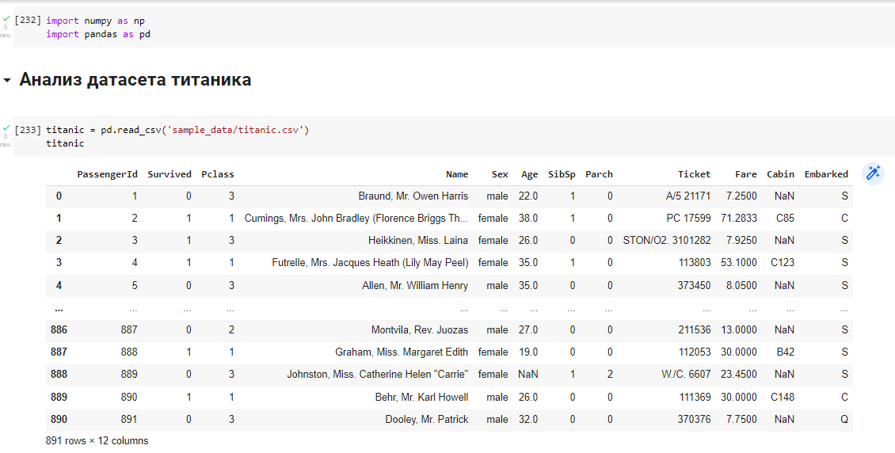
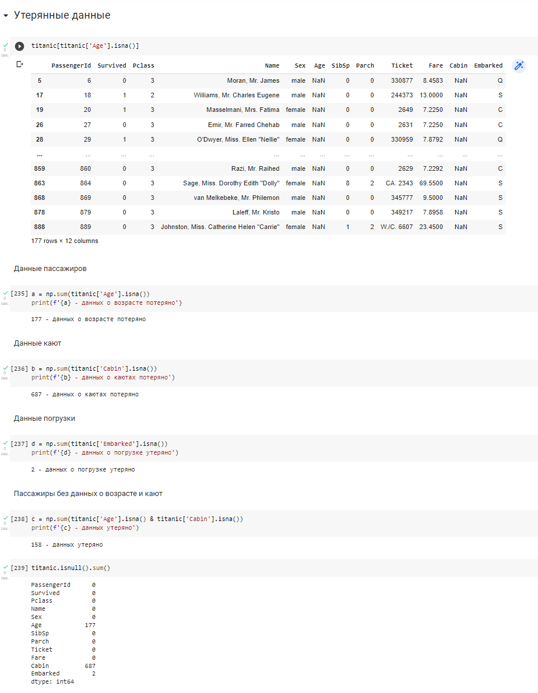
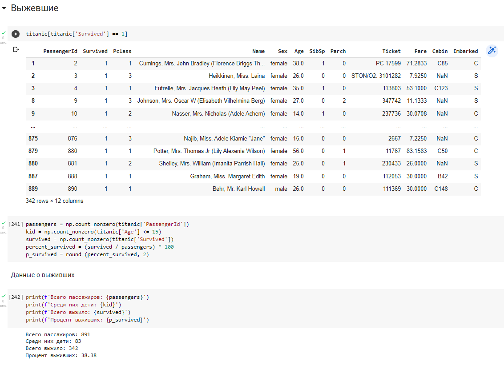
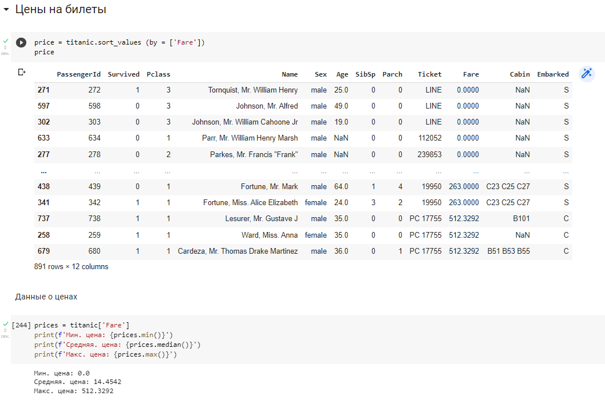

# Анализ датасета Титаника
### Данный проект представляет собой блокнот Titanic_Dataset.ipynb с анализами датасета Титаника. В результате анализа были выявлены данные о пассажирах (в том числе и о их отсутствии), выживших, а также цены на билеты

### Основная часть работы была сделана на сайте google collab
### Использованны модули: pandas и numpy

